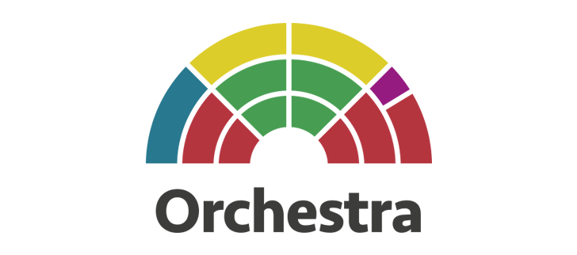

<p align="center">
  
</p>
<p align="center">
  <a title='Build Status' href="https://travis-ci.org/BedeGaming/orchestra">
    
  </a>
  <a href='https://coveralls.io/github/BedeGaming/orchestra?branch=coveralls'>
    
  </a>
  <a href='https://gitter.im/BedeGaming/orchestra?utm_source=badge&utm_medium=badge&utm_campaign=pr-badge&utm_content=body_badge'>
    
  </a>
</p>
All of the dependencies. None of the hassle. Just code.

Using a known set of compatible dependency versions, Orchestra takes the pain away from setting up your Marionette applications. Just install and go!

Utilising the power of the Marionette framework along with a proven architecture for messaging in Backbone.Radio you have the structure and core tools needed to implement large Javascript applications that are designed to support multi-currency and multi-languages from the outset.

## Install

To install Orchestra with node package manager use:

```
npm install --save orchestra
```

### Getting started

Orchestra works best using ES6 imports, we recommend using Babel.js to import the library. If you wish to use a different module loader take a look at the examples below:

*ES6*

```
import Orchestra from 'orchestra';
```

*Browserify*

```
var Orchestra = require('orchestra');
```

NOTE: we recommend the use of `browserify-shim` property to point to the commonjs version of Orchestra located in the `lib` folder. 

*Requirejs*

```
require.config({
    baseUrl: "/path/to/scripts",
    paths: {
        "Orchestra": "./node_modules/orchestra/lib/index"
    }
});
```

## Included Libraries

Orchestra exports a number of useful libraries used when building large scale Javascript applications, for details on the usage of these libraries please use the links below:

### Backbone.js
[repo](https://github.com/jashkenas/backbone) | [docs](http://backbonejs.org/)

_"Backbone.js gives structure to web applications by providing models with key-value binding and custom events, collections with a rich API of enumerable functions, views with declarative event handling, and connects it all to your existing API over a RESTful JSON interface."_

To access Backbone properties via Orchestra, simply replace `Backbone.` with `Orchestra.`

```
var Orchestra = require('orchestra');
var collection = new Orchestra.Collection();
```

### Marionette.js
[repo](https://github.com/marionettejs/backbone.marionette) | [docs](http://marionettejs.com/docs/current/)

_"Marionette simplifies your Backbone application code with robust views and architecture solutions."_

To use Marionette functionality just replace `Marionette.` with `Orchestra.`

```
var Orchestra = require('orchestra');
var CollectionView =  Orchestra.CollectionView.extend({});
```

### Lodash
[repo](https://github.com/lodash/lodash/) | [docs](https://lodash.com/docs)

_"A JavaScript utility library delivering consistency, modularity, performance, & extras."_

To access the Lodash API from Orchesra, just use the `Orchestra._` property.

```
var Orchestra = require('orchestra');
var _ = Orchestra._;

_.each(someArray, function(item, index) {
  console.log('item at ' + index + ' = ' + item);
});
```

### Backbone.Radio
[repo](https://github.com/marionettejs/backbone.radio)

_"Backbone.Radio provides additional messaging patterns for Backbone applications."_

To access Radio's API via Orchestra just use the `Orchestra.Radio` property.

```
var Orchestra = require('orchestra');
var soundChannel = Orchestra.Radio.channel('sound');
```

### Backbone.Routing
[repo](https://github.com/thejameskyle/backbone-routing)

_"Simple router and route classes for Backbone."_

Backbone.Routing exposes 2 classes: `Router` and `Route`. These class are available via Orchestra using
the following syntax:

```
var Orchestra = require('orchestra');

var IndexRoute = Orchestra.Route.extend({
  initialize(options) {
    this.foo = options.foo;
  },

  fetch: function() {
    // fetch model/collection
  },

  render: function() {
    // render a view, called after `fetch`
  },

  destroy: function() {
    // clean up view
  }
});

var Router = Orchestra.Router.extend({
  initialize: function(options) {
    // do stuff on init
    this.foo = options.foo;
  },

  onBeforeEnter: function() {
    // do something before entering any of the routes, e.g. check authentication, highlight navbar
  },

  routes: {
    '': 'index'
  },

  index: function() {
    return new IndexRoute({
      foo: this.foo
    });
  }
});
```

### Backbone.Service
[repo](https://github.com/thejameskyle/backbone.service)

_"Simple service class for Backbone."_

Backbone.Service extends Backbone.Radio's channel functionality by taking in a `requests` hash and returning a `Promise`
from each one. The `start` and `stop` methods make Backbone.Service a great way to break up applications into modular components. To use `Service`s in Orchestra, follow this API:

```
var Orchestra = require('orchestra');

var AuthService = Orchestra.Service.extend({
  start: function() {
    this.user = new User();
    return this.user.fetch();
  },

  requests: {
    isAuthenticated: 'isAuthenticated',
    authenticate: 'authenticate'
  },

  isAuthenticated: function() {
    return this.user.get('isAuthenticated');
  },

  authenticate: function() {
    this.user.authenticate();
  },

  onError: function(err) {
    console.log('Err!', err);
  }
});

var authService = new AuthService();

var Router = Orchestra.Router.extend({
  onBeforeEnter: function() {
    // check authentication
    authService.request('isAuthenticated').then(isAuthenticated => {
      if (!isAuthenticated) {
        this.cancel();
        history.navigate('login', { trigger: true });
        return;
      }
    }).catch(err => {
      if (!isAuthenticated) {
        this.cancel();
        history.navigate('login', { trigger: true });
        return;
      }
    });
  },

  routes: {
    '': 'index'
  },

  index: function() {
    return new IndexRoute();
  }
});
```

### Backbone.Storage
[repo](https://github.com/thejameskyle/backbone.storage)

_"A simple storage class for Backbone Models and Collections."_

Backbone Storage combines Backbone Models and Collections into a single, easy to use API. To access the Storage class in Orchestra, use the following API:

```
var Orchestra = require('orchestra');
var Book = require('./model)';
var Books = require('./collection');

var BookStore = Orchestra.Storage.extend({
  model: Book,
  collection: Books
});

var bookStore = new BookStore();

// get a single book
bookStore.find(1).then(model => {
  model.get('name'); // >> A Tale of Two Cities
});

// get all books
bookStore.findAll().then(collection => {
  collection.length; // >> 10
});

// save a book to the server
var book = new Book({ name: 'Lolita' });
bookStore.save(book).then(model => {
  model.id; // >> 11
});
```

### Backbone.Cocktail
[repo](https://github.com/onsi/cocktail)

_"Break out your shared Backbone.js model/collection/view behaviors into separate modules and mix them into your classes with Cocktail - an implementation of Backbone mixins."_

To add mixins to your Backbone classes with Orchestra, follow this API:

```
var Orchestra = require('orchestra');
var CollectionView =  Orchestra.CollectionView.extend({});

Orchestra.mixin(CollectionView, MyMixins.SelectMixin, MyMixins.SomeOtherMixin);
```

### Backbone.Syphon
[repo](https://github.com/marionettejs/backbone.syphon)

_"Backbone.Syphon aims to make it easy to serialize the fields of a Backbone.View into a simple JSON object that contains all of the values."_

To easily serialize forms fields into a JSON representation with Orchestra, follow this API:

```
Orchestra.LayoutView.extend({
  events: {
    "submit form": "formSubmitted"
  },
  formSubmitted: function(e){
    e.preventDefault();
    var data = Backbone.Syphon.serialize(this);
  },
});
```

### Backbone.Validation
[repo](https://github.com/thedersen/backbone.validation)

_"A validation plugin for Backbone.js that validates both your model as well as form input."_

To validate forms and inputs with Orchestra, follow this API:

```
// Define validation schema in model
var User = Orchestra.Model.extend({
  validation: {
    email: {
      required: true,
      pattern: 'email',
    },
    age: {
      range: [1, 80]
    },
  }
});

// Bind validation to view
var View = Orchestra.LayoutView.extend({
  initialize: function(){
    this.model = new User();
    Orchestra.Validation.bind(this);
  },
  events: {
    "submit form": "formSubmitted"
  },
  formSubmitted: function(e){
    this.model.preValidate({
      email: 'example@dom.com',
      age: 55,
    });
  },
});
```

### jQuery
[repo](https://github.com/jquery/jquery) | [docs](http://api.jquery.com/)

_"jQuery is a fast, small, and feature-rich JavaScript library. It makes things like HTML document traversal and manipulation, event handling, animation, and Ajax much simpler with an easy-to-use API that works across a multitude of browsers."_

To access the `$` property via Orchestra look at the following example:

```
var Orchestra = require('orchestra');
var $ = Orchestra.$;

$('#someSelector').append('<p>hi!</p>');
```

### Handlebars
[repo](https://github.com/wycats/handlebars.js) | [docs](http://handlebarsjs.com/)

_"Handlebars provides the power necessary to let you build semantic templates effectively with no frustration."_

Orchestra recommends the use of Handlebars as a templating language for your view layer. The framework provides some useful helpers to allow you to manage multi-currency and multi-language applications.

## Built-in Helpers

* [Currency](/docs/currency-helper.md)
* [Translation](/docs/translate-helper.md)
* [Local Storage](/docs/localstorage-helper.md)
* [Touch View](/docs/touch-view.md)
* [Visibility](/docs/visibility-helper.md)
